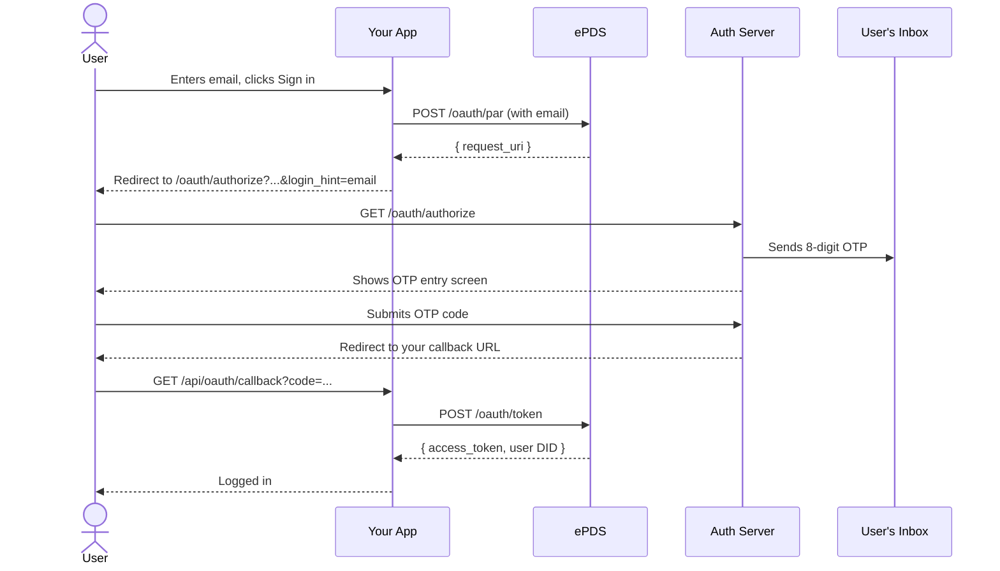
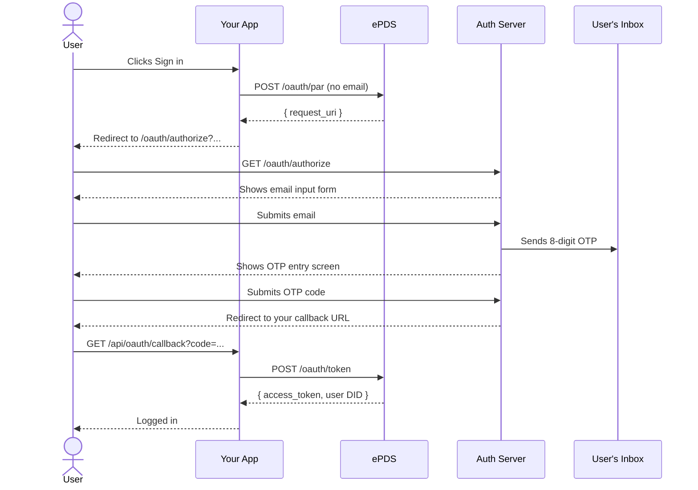

# Flow Walkthroughs

## Which flow should I use?

**Flow 1** — your app has its own email input field. You pass the email to
ePDS and the user lands straight on the OTP entry screen.

**Flow 2** — your app has a simple "Sign in" button with no email field. The
ePDS auth page collects the email.

Both flows end the same way: the user gets an 8-digit OTP by email, enters it,
and your callback receives an authorization code to exchange for tokens.

---

## Flow 1 — App collects the email

### Step-by-step

1. User enters their email in your app and clicks "Sign in"
2. Your login handler:
   a. Generates a DPoP key pair and PKCE verifier (see [dpop-pkce.md](dpop-pkce.md))
   b. POSTs to `/oauth/par` with `login_hint=<email>` (see code below)
   c. Stores DPoP private key, code verifier, and state in a signed session cookie
   d. Redirects the browser to `/oauth/authorize?...&login_hint=<email>`
3. The auth server sees the email, immediately sends the OTP, and shows the user
   the code entry screen (no email form shown)
4. User reads OTP from email and submits it
5. Auth server verifies the code and redirects to your `redirect_uri` with `?code=`
6. Your callback handler exchanges the code for tokens (see code below)
7. You get an access token and the user's DID — they're logged in

### Login handler code

```typescript
import {
  generateDpopKeyPair, generateCodeVerifier, generateCodeChallenge,
  generateState, createDpopProof,
} from './auth-helpers'

const PAR_ENDPOINT = 'https://pds.example.com/oauth/par'
const AUTH_ENDPOINT = 'https://auth.pds.example.com/oauth/authorize'
const CLIENT_ID = 'https://yourapp.example.com/client-metadata.json'
const REDIRECT_URI = 'https://yourapp.example.com/api/oauth/callback'

export async function handleLogin(email: string) {
  const { privateKey, publicJwk, privateJwk } = generateDpopKeyPair()
  const codeVerifier = generateCodeVerifier()
  const codeChallenge = generateCodeChallenge(codeVerifier)
  const state = generateState()

  const parBody = new URLSearchParams({
    client_id: CLIENT_ID,
    redirect_uri: REDIRECT_URI,
    response_type: 'code',
    scope: 'atproto transition:generic',
    state,
    code_challenge: codeChallenge,
    code_challenge_method: 'S256',
    login_hint: email,  // Flow 1: include the email
  })

  // ePDS always requires a nonce on the first attempt — retry automatically
  const makeProof = (nonce?: string) =>
    createDpopProof({ privateKey, jwk: publicJwk, method: 'POST', url: PAR_ENDPOINT, nonce })

  let parRes = await fetch(PAR_ENDPOINT, {
    method: 'POST',
    headers: { 'Content-Type': 'application/x-www-form-urlencoded', DPoP: makeProof() },
    body: parBody.toString(),
  })
  if (!parRes.ok) {
    const nonce = parRes.headers.get('dpop-nonce')
    if (nonce && parRes.status === 400) {
      parRes = await fetch(PAR_ENDPOINT, {
        method: 'POST',
        headers: { 'Content-Type': 'application/x-www-form-urlencoded', DPoP: makeProof(nonce) },
        body: parBody.toString(),
      })
    }
  }
  if (!parRes.ok) throw new Error(`PAR failed: ${parRes.status}`)
  const { request_uri } = await parRes.json()

  // Save session data in a signed cookie for the callback
  setSessionCookie({ state, codeVerifier, dpopPrivateJwk: privateJwk })

  // Redirect user to auth server — include login_hint so OTP screen shows immediately
  const authUrl = new URL(AUTH_ENDPOINT)
  authUrl.searchParams.set('client_id', CLIENT_ID)
  authUrl.searchParams.set('request_uri', request_uri)
  authUrl.searchParams.set('login_hint', email)
  return redirect(authUrl.toString())
}
```

> **Important:** Pass `login_hint` in both the PAR body _and_ the redirect URL.
> Missing it from the redirect URL causes a flash of the email form before the
> OTP screen appears.

---

## Flow 2 — Auth server collects the email

### Step-by-step

1. User clicks "Sign in" in your app (no email needed yet)
2. Your login handler:
   a. Generates a DPoP key pair and PKCE verifier
   b. POSTs to `/oauth/par` (no `login_hint`)
   c. Stores session data in cookie
   d. Redirects browser to `/oauth/authorize?...`
3. The auth server shows an email input form
4. User enters their email and submits
5. Auth server sends OTP and shows code entry screen
6. User enters OTP
7. Auth server redirects to your `redirect_uri` with `?code=`
8. Your callback exchanges the code for tokens

### Login handler code

Same as Flow 1 but omit `login_hint` from the PAR body and the redirect URL:

```typescript
const parBody = new URLSearchParams({
  client_id: CLIENT_ID,
  redirect_uri: REDIRECT_URI,
  response_type: 'code',
  scope: 'atproto transition:generic',
  state,
  code_challenge: codeChallenge,
  code_challenge_method: 'S256',
  // No login_hint
})

// ... same PAR request and retry logic as Flow 1 ...

const authUrl = new URL(AUTH_ENDPOINT)
authUrl.searchParams.set('client_id', CLIENT_ID)
authUrl.searchParams.set('request_uri', request_uri)
// No login_hint
return redirect(authUrl.toString())
```

---

## Callback handler (both flows)

After the user authenticates, ePDS redirects them to your `redirect_uri` with
`?code=` and `?state=`. Verify the state, then exchange the code for tokens:

```typescript
import { restoreDpopKeyPair, createDpopProof } from './auth-helpers'

const TOKEN_ENDPOINT = 'https://pds.example.com/oauth/token'

export async function handleCallback(params: { code: string; state: string }) {
  const session = getSessionFromCookie()
  if (params.state !== session.state) throw new Error('state mismatch')

  const { privateKey, publicJwk } = restoreDpopKeyPair(session.dpopPrivateJwk)

  const tokenBody = new URLSearchParams({
    grant_type: 'authorization_code',
    code: params.code,
    redirect_uri: REDIRECT_URI,
    client_id: CLIENT_ID,
    code_verifier: session.codeVerifier,
  })

  const makeProof = (nonce?: string) =>
    createDpopProof({ privateKey, jwk: publicJwk, method: 'POST', url: TOKEN_ENDPOINT, nonce })

  let tokenRes = await fetch(TOKEN_ENDPOINT, {
    method: 'POST',
    headers: { 'Content-Type': 'application/x-www-form-urlencoded', DPoP: makeProof() },
    body: tokenBody.toString(),
  })
  if (!tokenRes.ok) {
    const nonce = tokenRes.headers.get('dpop-nonce')
    if (nonce) {
      tokenRes = await fetch(TOKEN_ENDPOINT, {
        method: 'POST',
        headers: { 'Content-Type': 'application/x-www-form-urlencoded', DPoP: makeProof(nonce) },
        body: tokenBody.toString(),
      })
    }
  }
  if (!tokenRes.ok) throw new Error(`Token exchange failed: ${tokenRes.status}`)

  const { access_token, sub: userDid } = await tokenRes.json()

  // userDid is e.g. "did:plc:abc123..." — resolve to a readable handle if needed:
  const plcRes = await fetch(`https://plc.directory/${userDid}`)
  const { alsoKnownAs } = await plcRes.json()
  const handle = alsoKnownAs
    ?.find((u: string) => u.startsWith('at://'))
    ?.replace('at://', '')
  // e.g. "a3x9kf.pds.example.com"

  // Store access_token and userDid in your session — user is now logged in
}
```

---

## Sequence diagrams

### Flow 1



### Flow 2


