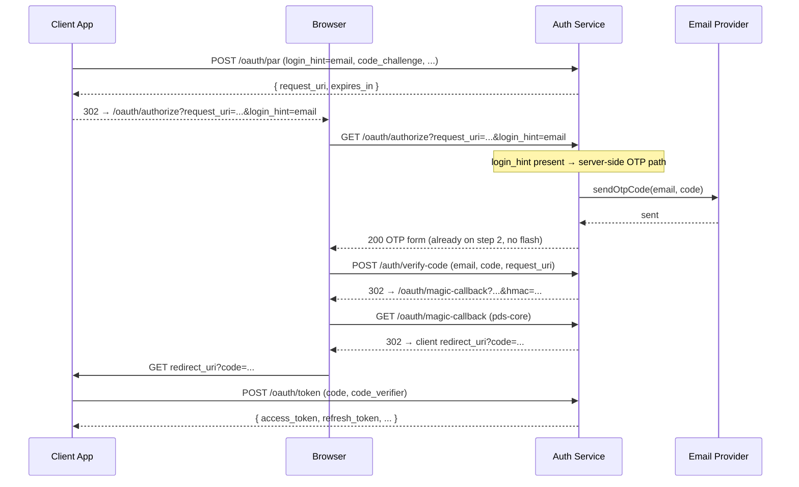
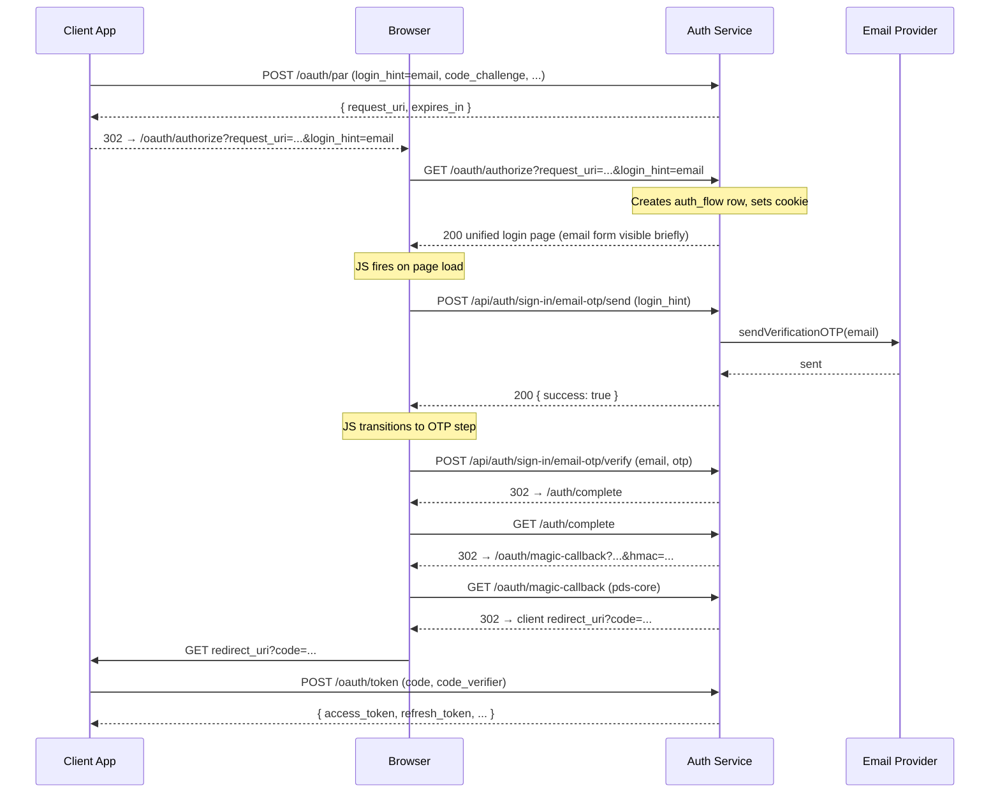

# OTP Send: Client-side vs. Server-side

Design decision record for `atproto-trf` / `atproto-ke8`.

## Background

When `GET /oauth/authorize` is called with a `login_hint` email (Flow 1), the
auth service needs to send an OTP to that address and show the OTP entry form.
There are two ways to trigger that send.

The original `magic-pds` branch sent the OTP **server-side** inside the GET
handler, then rendered the OTP form directly. The migration to better-auth
switched to a **client-side** approach: render the page, then have the browser
call the better-auth OTP endpoint via `fetch()` on page load.

## Old approach (magic-pds branch)

The OTP was sent server-side in the GET handler, then the OTP form was rendered
directly — no flash, no client-side JS send.

## Current approach (main branch)

The page is rendered first, then the browser calls the better-auth OTP endpoint
via `fetch()` on page load. This causes a brief flash of the email form before
the OTP step appears.

## Why it was changed to client-side

The old approach used a custom `tokenService` (`magic-link/token.ts`) that could
be called synchronously in the GET handler. When migrating to better-auth
(`6c7c0c30`), OTP sending had to go through better-auth's own HTTP endpoint
(`POST /api/auth/sign-in/email-otp/send`). Calling that server-side requires
`auth.api.sendVerificationOTP()`, which is async and has its own session/cookie
behaviour. The simpler path was to let the browser call the endpoint directly —
better-auth handles its own CSRF for API calls automatically, so no CSRF token
threading was needed.

Note: the recovery flow (`recovery.ts`) already calls
`auth.api.sendVerificationOTP()` server-side successfully, so a server-side send
is known to be feasible.

## Comparison

### Summary

| | Old (magic-pds) | Current (main) |
|---|---|---|
| OTP send | Server-side in GET handler | Client-side JS on page load |
| Flash | None — OTP form rendered directly | Yes — email form briefly visible |
| Duplicate GET | Second GET re-sends OTP (same bug) | Second GET re-sends OTP via JS |
| Route chain | authorize.ts → send-code.ts → verify-code.ts | login-page.ts (unified) |
| Session | Custom tokenService / sessionId | better-auth |

### Client-side send (current)

| Pros | Cons |
|------|------|
| Simple — no server-side async call needed | Flash of email form before OTP step appears |
| better-auth CSRF handled automatically | Duplicate GET triggers second OTP send via JS |
| Resend button uses the same code path | OTP send can fail silently if JS errors |
| Social login buttons follow the same pattern | Requires JS — broken if browser blocks scripts |
| Easy to show loading states in UI | Extra round-trip: page load → JS fetch → OTP |

### Server-side send (old / proposed fix)

| Pros | Cons |
|------|------|
| No flash — OTP form rendered immediately | Must call `auth.api.sendVerificationOTP()` async in GET handler |
| Duplicate GETs blocked by request_uri dedup fix | better-auth may have session/cookie side effects to verify |
| Works without JS | Error handling harder — no UI feedback mid-render |
| One fewer round-trip | Resend button still needs the JS path anyway |

## Decision

Move OTP send back to the server side, using `auth.api.sendVerificationOTP()`
as the recovery flow already does. Combined with the `request_uri` idempotency
fix (`getAuthFlowByRequestUri`), this prevents duplicate OTPs regardless of
whether a second GET arrives from a browser extension or prefetch.

The client-side JS path (Resend button, social login) is retained — only the
initial auto-send on page load moves server-side.

## Open questions

- Does calling `auth.api.sendVerificationOTP()` in the GET handler have any
  unintended better-auth session/cookie side effects? (Check against recovery.ts
  which does the same thing.)
- What should be rendered if the server-side OTP send fails? The old approach
  rendered the OTP form with an inline error; the current unified page should
  do the same.
