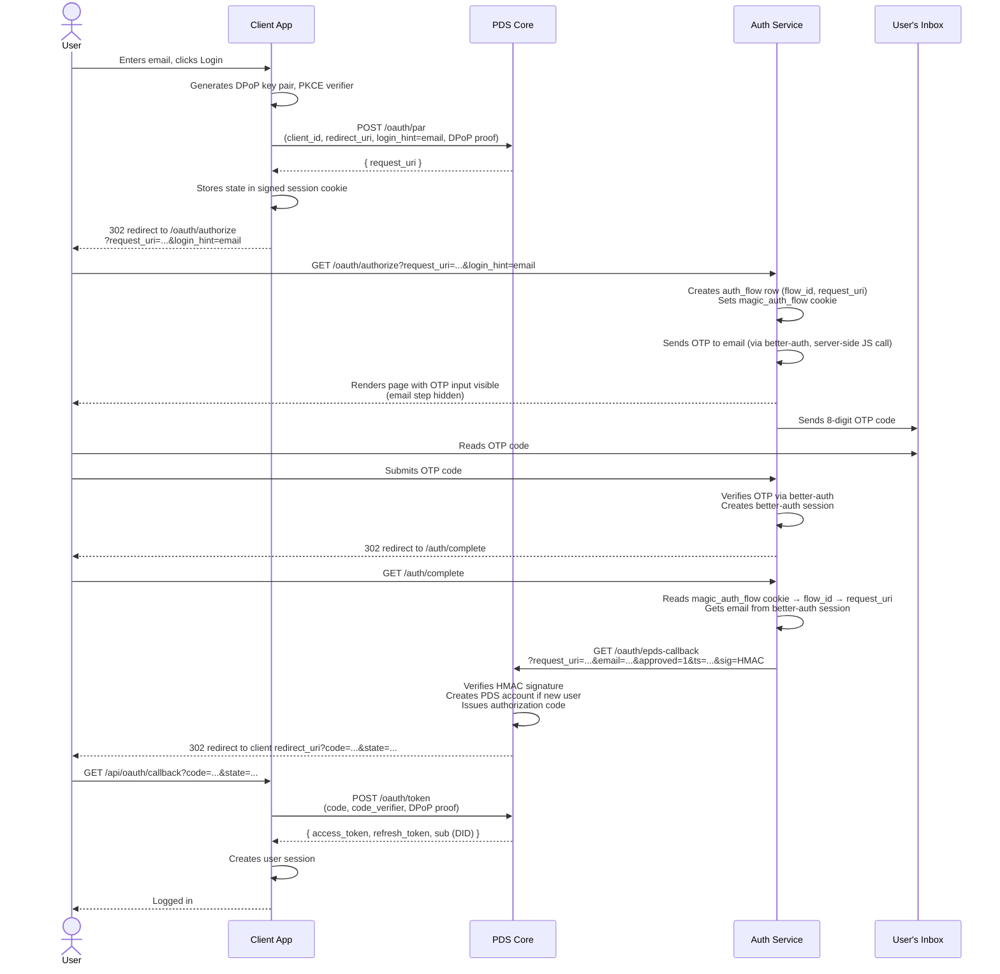
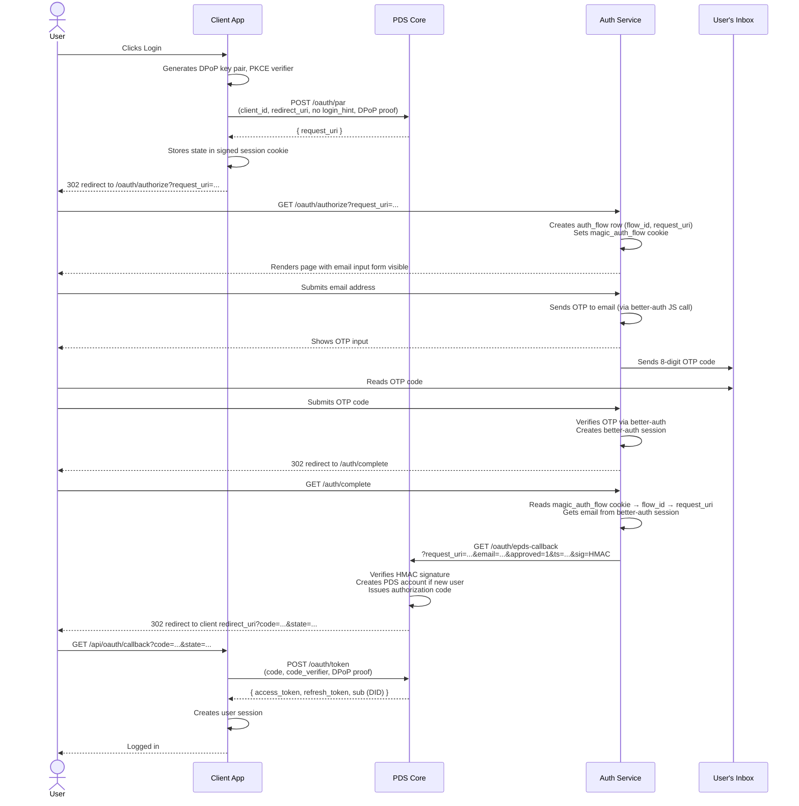

# Login Flows & Integration Guide

## Overview

ePDS lets users log in with their email address. There are no passwords — the
user receives a one-time code by email and enters it to authenticate. Your app
sends the user to ePDS, the user authenticates there, and ePDS sends them back
to your app with a token you can use to make API calls on their behalf.

## Login Flows

There are two ways to integrate:

**Flow 1** — your app has its own email input. You pass the email to ePDS and
the user lands directly on the code-entry screen.

**Flow 2** — your app has a simple "Sign in" button. ePDS shows the email form
itself.

Both flows end the same way: the user enters their code, ePDS redirects back to
your app, and your app exchanges that redirect for a token.

## Flow 1 — App has its own email form

1. User enters email in your app and clicks "Sign in"
2. Your login handler registers the login attempt with ePDS (passing the email)
3. Your app redirects the user's browser to the ePDS auth page (with the email)
4. ePDS immediately sends the OTP and shows the code-entry screen
5. User reads the 8-digit code from their email and submits it
6. ePDS verifies the code and redirects back to your app's callback URL
7. Your callback handler exchanges the redirect for an access token
8. User is logged in

## Flow 2 — App has a simple login button

1. User clicks "Sign in" in your app
2. Your login handler registers the login attempt with ePDS
3. Your app redirects the user's browser to the ePDS auth page
4. ePDS shows an email input form
5. User enters their email and submits
6. ePDS sends the OTP and shows the code-entry screen
7. User reads the 8-digit code from their email and submits it
8. ePDS verifies the code and redirects back to your app's callback URL
9. Your callback handler exchanges the redirect for an access token
10. User is logged in

## Sequence Diagrams

### Flow 1 — App has its own email form



### Flow 2 — App has a simple login button



## Integration Reference

### Register your app

Before users can log in, you need to tell ePDS about your app. You do this by
hosting a small JSON file at a public HTTPS URL — this URL also acts as your
app's identifier. ePDS fetches this file to verify your app is legitimate and
to find your callback URL.

The file must be served with `Content-Type: application/json`:

```json
{
  "client_id": "https://yourapp.example.com/client-metadata.json",
  "client_name": "Your App Name",
  "client_uri": "https://yourapp.example.com",
  "logo_uri": "https://yourapp.example.com/logo.png",
  "redirect_uris": ["https://yourapp.example.com/api/oauth/callback"],
  "scope": "atproto transition:generic",
  "grant_types": ["authorization_code", "refresh_token"],
  "response_types": ["code"],
  "token_endpoint_auth_method": "none",
  "dpop_bound_access_tokens": true
}
```

The last four fields are fixed values required by the AT Protocol — copy them
as-is. The only things you need to change are `client_id`, `client_name`,
`client_uri`, `logo_uri`, and `redirect_uris`.

#### Optional branding

You can customise the OTP email and login page colours:

```json
{
  "email_template_uri": "https://yourapp.example.com/email-template.html",
  "email_subject_template": "{{code}} — Your {{app_name}} code",
  "brand_color": "#000000",
  "background_color": "#ffffff"
}
```

The email template must be an HTML file containing at minimum a `{{code}}`
placeholder. Supported template variables:

| Variable                              | Description                               |
| ------------------------------------- | ----------------------------------------- |
| `{{code}}`                            | The 8-digit OTP code (required)           |
| `{{app_name}}`                        | Value of `client_name` from your metadata |
| `{{logo_uri}}`                        | Value of `logo_uri` from your metadata    |
| `{{#is_new_user}}...{{/is_new_user}}` | Shown only on first sign-up               |
| `{{^is_new_user}}...{{/is_new_user}}` | Shown only on subsequent sign-ins         |

### Security helpers

ePDS uses two standard security mechanisms to protect the login flow:

- **PKCE** — prevents an attacker who intercepts the final redirect from using
  the code themselves
- **DPoP** — binds the access token to your server so it can't be used by
  anyone who steals it

You don't need to understand the details — just copy these helper functions
(from [packages/demo](../packages/demo)) and call them as shown in the code
examples below:

```typescript
import * as crypto from 'node:crypto'

// PKCE
export function generateCodeVerifier(): string {
  return crypto.randomBytes(32).toString('base64url')
}

export function generateCodeChallenge(verifier: string): string {
  return crypto.createHash('sha256').update(verifier).digest('base64url')
}

// DPoP key pair — generate once per OAuth flow, never reuse across flows
export function generateDpopKeyPair() {
  const { publicKey, privateKey } = crypto.generateKeyPairSync('ec', {
    namedCurve: 'P-256',
  })
  return {
    privateKey,
    publicJwk: publicKey.export({ format: 'jwk' }),
    privateJwk: privateKey.export({ format: 'jwk' }),
  }
}

// Restore a DPoP key pair from a serialized private JWK (e.g. from session)
export function restoreDpopKeyPair(privateJwk: crypto.JsonWebKey) {
  const privateKey = crypto.createPrivateKey({ key: privateJwk, format: 'jwk' })
  const publicKey = crypto.createPublicKey(privateKey)
  return { privateKey, publicJwk: publicKey.export({ format: 'jwk' }) }
}

// Create a DPoP proof JWT
export function createDpopProof(opts: {
  privateKey: crypto.KeyObject
  jwk: object
  method: string
  url: string
  nonce?: string
  accessToken?: string
}): string {
  const header = { alg: 'ES256', typ: 'dpop+jwt', jwk: opts.jwk }
  const payload: Record<string, unknown> = {
    jti: crypto.randomUUID(),
    htm: opts.method,
    htu: opts.url,
    iat: Math.floor(Date.now() / 1000),
  }
  if (opts.nonce) payload.nonce = opts.nonce
  if (opts.accessToken) {
    payload.ath = crypto
      .createHash('sha256')
      .update(opts.accessToken)
      .digest('base64url')
  }

  const headerB64 = Buffer.from(JSON.stringify(header)).toString('base64url')
  const payloadB64 = Buffer.from(JSON.stringify(payload)).toString('base64url')
  const signingInput = `${headerB64}.${payloadB64}`
  const sig = crypto.sign('sha256', Buffer.from(signingInput), opts.privateKey)
  return `${signingInput}.${derToRaw(sig).toString('base64url')}`
}

// Convert DER-encoded ECDSA signature to raw r||s (required for ES256 JWTs)
function derToRaw(der: Buffer): Buffer {
  let offset = 2
  if (der[1]! > 0x80) offset += der[1]! - 0x80
  offset++ // skip 0x02
  const rLen = der[offset++]!
  let r = der.subarray(offset, offset + rLen)
  offset += rLen
  offset++ // skip 0x02
  const sLen = der[offset++]!
  let s = der.subarray(offset, offset + sLen)
  if (r.length > 32) r = r.subarray(r.length - 32)
  if (s.length > 32) s = s.subarray(s.length - 32)
  const raw = Buffer.alloc(64)
  r.copy(raw, 32 - r.length)
  s.copy(raw, 64 - s.length)
  return raw
}
```

### Login handler — registering the login attempt

Your login handler calls ePDS's `/oauth/par` endpoint to register the login
attempt. ePDS returns a short-lived token (`request_uri`) that identifies this
specific login attempt. You then redirect the user to the auth page with that
token.

ePDS always rejects the first call with a security challenge — your code
must catch that and retry with the challenge value included. The code below
handles this automatically:

```typescript
const parBody = new URLSearchParams({
  client_id: clientId,
  redirect_uri: redirectUri,
  response_type: 'code',
  scope: 'atproto transition:generic',
  state,
  code_challenge: codeChallenge,
  code_challenge_method: 'S256',
  // Flow 1 only — omit for Flow 2:
  login_hint: email,
})

// First attempt (will get a 400 with dpop-nonce)
let parRes = await fetch(parEndpoint, {
  method: 'POST',
  headers: {
    'Content-Type': 'application/x-www-form-urlencoded',
    DPoP: dpopProof,
  },
  body: parBody.toString(),
})

// Retry with nonce if required
if (!parRes.ok) {
  const dpopNonce = parRes.headers.get('dpop-nonce')
  if (dpopNonce && parRes.status === 400) {
    dpopProof = createDpopProof({
      privateKey,
      jwk: publicJwk,
      method: 'POST',
      url: parEndpoint,
      nonce: dpopNonce,
    })
    parRes = await fetch(parEndpoint, {
      method: 'POST',
      headers: {
        'Content-Type': 'application/x-www-form-urlencoded',
        DPoP: dpopProof,
      },
      body: parBody.toString(),
    })
  }
}

const { request_uri } = await parRes.json()
```

### Redirecting the user to ePDS

After registering the login attempt, redirect the user's browser to the ePDS
auth page. For Flow 1, include the email so ePDS skips its own email form and
goes straight to OTP entry:

```typescript
// Flow 1
const authUrl = `${authEndpoint}?client_id=${encodeURIComponent(clientId)}&request_uri=${encodeURIComponent(request_uri)}&login_hint=${encodeURIComponent(email)}`

// Flow 2
const authUrl = `${authEndpoint}?client_id=${encodeURIComponent(clientId)}&request_uri=${encodeURIComponent(request_uri)}`
```

Store the DPoP private key, `codeVerifier`, and `state` in a signed HttpOnly
session cookie so the callback handler can retrieve them:

```typescript
// Before redirecting, save OAuth state in a signed cookie
response.cookies.set('oauth_session', signedSessionCookie, {
  httpOnly: true,
  secure: true,
  sameSite: 'lax',
  maxAge: 600, // 10 minutes — matches PAR request_uri lifetime
  path: '/',
})
```

### Callback handler — exchanging the redirect for a token

After the user authenticates, ePDS redirects them back to your callback URL
with a short-lived code. Your callback handler checks it's a genuine redirect
from this login attempt (by verifying the `state` value you stored earlier),
then exchanges the code for an access token:

```typescript
// Verify state matches what we stored
if (params.state !== sessionData.state) throw new Error('state mismatch')

const { privateKey, publicJwk } = restoreDpopKeyPair(sessionData.dpopPrivateJwk)

const tokenBody = new URLSearchParams({
  grant_type: 'authorization_code',
  code: params.code,
  redirect_uri: redirectUri,
  client_id: clientId,
  code_verifier: sessionData.codeVerifier,
})

// First attempt
let dpopProof = createDpopProof({
  privateKey,
  jwk: publicJwk,
  method: 'POST',
  url: tokenEndpoint,
})
let tokenRes = await fetch(tokenEndpoint, {
  method: 'POST',
  headers: {
    'Content-Type': 'application/x-www-form-urlencoded',
    DPoP: dpopProof,
  },
  body: tokenBody.toString(),
})

// Retry with nonce if required
if (!tokenRes.ok) {
  const dpopNonce = tokenRes.headers.get('dpop-nonce')
  if (dpopNonce) {
    dpopProof = createDpopProof({
      privateKey,
      jwk: publicJwk,
      method: 'POST',
      url: tokenEndpoint,
      nonce: dpopNonce,
    })
    tokenRes = await fetch(tokenEndpoint, {
      method: 'POST',
      headers: {
        'Content-Type': 'application/x-www-form-urlencoded',
        DPoP: dpopProof,
      },
      body: tokenBody.toString(),
    })
  }
}

const { access_token, sub: userDid } = await tokenRes.json()
```

The `sub` field in the token response is the user's AT Protocol identity
(a DID, e.g. `did:plc:abc123...`). You can resolve it to a human-readable
handle via the PLC directory:

```typescript
const plcRes = await fetch(`https://plc.directory/${userDid}`)
const { alsoKnownAs } = await plcRes.json()
const handle = alsoKnownAs
  ?.find((u: string) => u.startsWith('at://'))
  ?.replace('at://', '')
// e.g. "a3x9kf.epds-poc1.example.com"
```

### User handles

Each user gets a randomly generated handle (e.g. `a3x9kf.pds.example.com`).
Handles are not derived from the user's email address, for privacy.

## Why does the user have to leave my app at all? (Flow 1)

Even in Flow 1, where your app already has the email, the user still has to
be briefly redirected to the ePDS auth page. This is a requirement of the
AT Protocol:

- The final authentication step (verifying the OTP) must happen on ePDS's
  domain, not your app's domain
- Future authentication methods (passkeys, WebAuthn) need to be bound to ePDS's
  origin — your app's origin won't work for those
